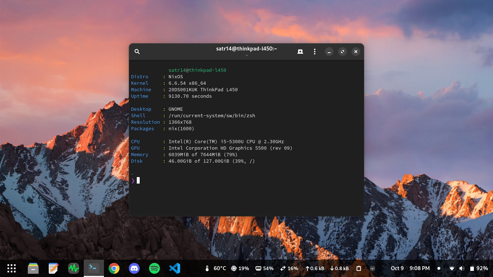

```sh
# update hw config:
nixos-generate-config --show-hardware-config > hw-scan.nix

# installation
sudo nixos-rebuild switch --flake .#nixos

# using a thinkpad? (custom fan speeds, check hw-thinkpad.nix)
sudo nixos-rebuild switch --flake .#thinkpad
```
