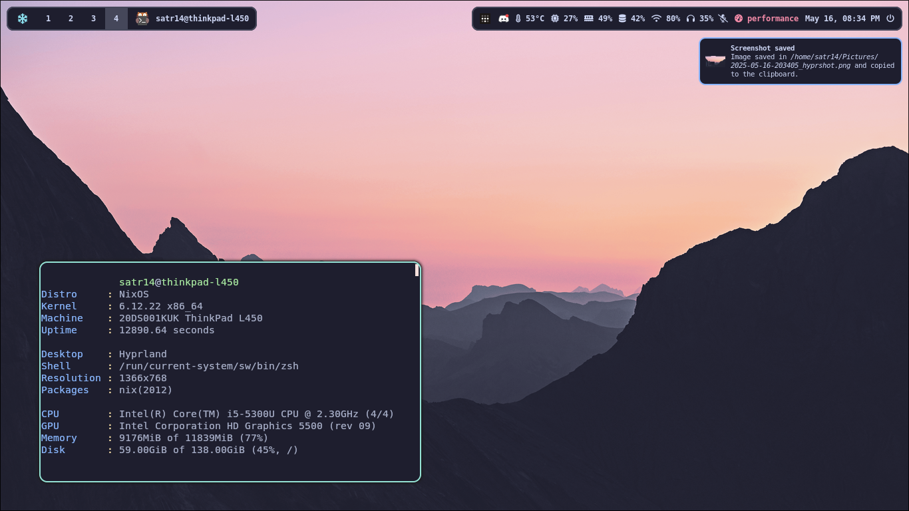

> [!WARNING]
> 1. It's recommended to use swapfile/partition while building to avoid OOM killer.
> 2. **This repository is ment for personal use** so expect little to no documentation.


> [!NOTE]
> 1. This repository does not include the wallpaper used in the screenshot.
> 2. Most GUI apps are configured via account syncing and are not configured via home-manager.
> 3. Some `options.nix` are unused. Most likely WIP.

to create a swapfile:

```sh
sudo dd if=/dev/zero of=/swapfile bs=512M count=4 # change this to the amount required
sudo chmod 600 /swapfile
sudo mkswap /swapfile
sudo swapon /swapfile
```

to build the system:

```sh
# 0. clone repo and edit options:
nix-shell -p git vim tmux htop home-manager #  tmux and htop for monitoring
git clone github.com/SX-9/nix-conf --depth 1
vim options.nix # configure the system here

# 1. hardware config:
nixos-generate-config --show-hardware-config > hardware/scan.nix
git add . -f # (-f)orce add hardware scan as its in .gitignore

# 2. apply nixos config
sudo nixos-rebuild switch --flake .#thinkpad

# 3. apply home config
home-manager switch --flake .#main
```

or with `nixos-anywhere`

```sh
vim options.nix # change config to enable disko
vim disko/default.nix # change disk partitioning
nixos-anywhere --generate-hardware-config nixos-generate-config ./hardware/scan.nix --flake .#FLAKE --target-host root@HOST
```
