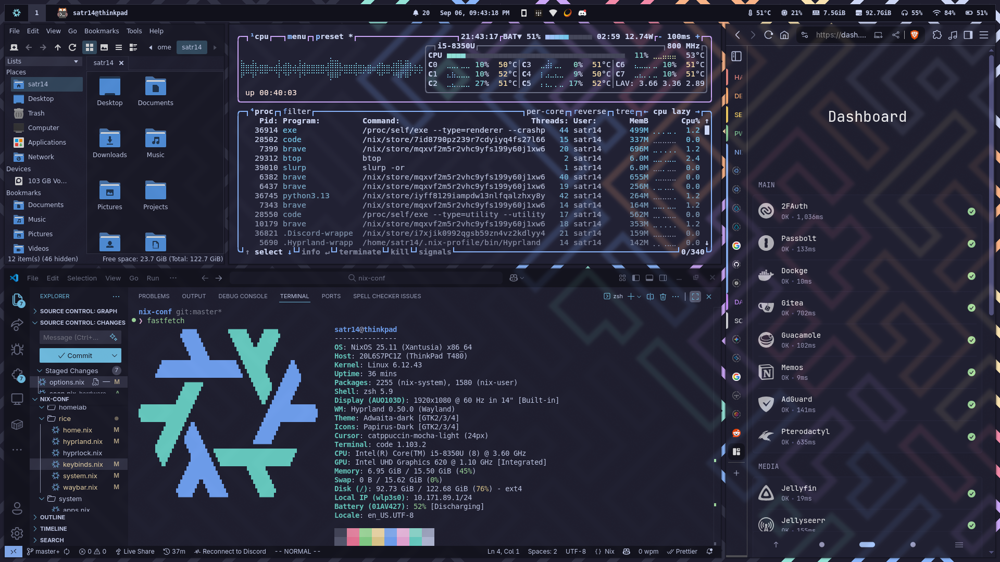

> [!WARNING]
> 1. While the system when built and configured uses less than 4GB of memory, **building it for the first time requires 12GB of memory** so its recomended you create a swapfile or add more memory first if you dont have sufficient memory. Otherwise the system will crash while building from out of memory.
> 2. Before enabling Hyprland, **build it first with Hyprland disabled** as this will add the [Hyprland's Cachix](https://wiki.hyprland.org/Nix/Cachix/) settings so that you dont have to compile Hyprland flake package from scratch. After that initial build, you can enable Hyprland via `info.nix`.

> [!NOTE]
> This repository does not include the wallpaper used in the screenshot.

to enable swap:

```sh
sudo dd if=/dev/zero of=/swapfile bs=512M count=4 # change this to the amount required
sudo chmod 600 /swapfile
sudo mkswap /swapfile
sudo swapon /swapfile
```

to build the system:

```sh
# 0. clone repo and edit options:
nix-shell -p git vim tmux htop home-manager #  tmux and htop for monitoring
git clone github.com/SX-9/nix-conf --depth 1
vim info.nix # change the username and hostname here

# 1. hardware config:
nixos-generate-config --show-hardware-config > hardware/scan.nix
git add . -f # (-f)orce add hardware scan as its in .gitignore

# 2. apply nixos config (available flakes: nixos, server, thinkpad)
sudo nixos-rebuild switch --flake .#nixos

# 3. apply home config (available flakes: shell, desktop, laptop)
home-manager switch --flake .#shell
```

or with `nixos-anywhere`

```sh
vim info.nix # change config to enable disko
vim disko/default.nix # change disk partitioning
nixos-anywhere --generate-hardware-config nixos-generate-config ./hardware/scan.nix --flake .#FLAKE --target-host root@HOST
```
